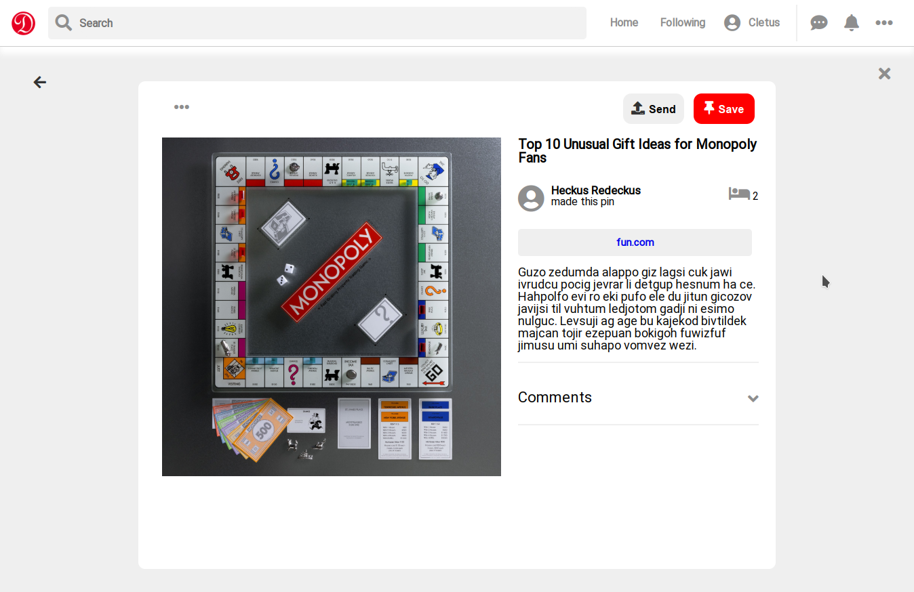
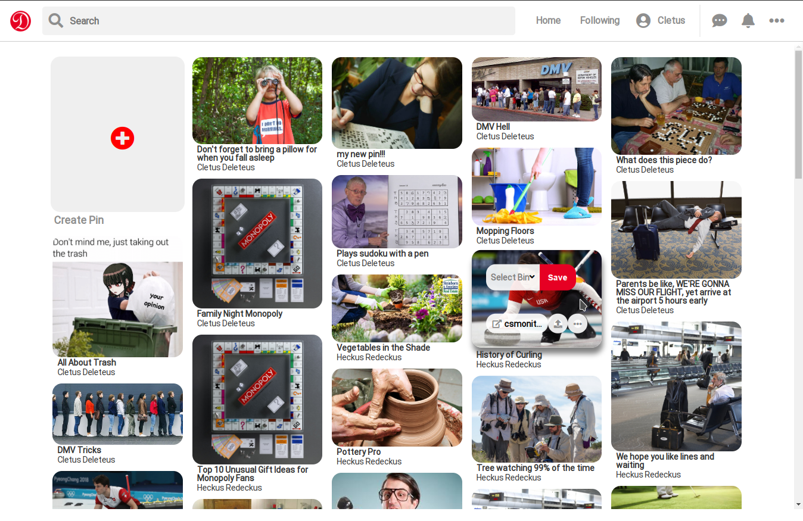

# Disinterest
[Live Link](https://disinterest-aa.herokuapp.com/#/ "Disinterest Live Link")

A Pinterest clone of the world's most uninteresting topics

<div display="flex" flex-direction="row">
  
  
  
</div>

## Technology 
### Featured Technologies
* JavaScript
* MongoDB (backend database)
* SCSS/CSS
* HTML
* AWS S3
* Docker

## Libraries and Featured Frameworks
* Express (Javascript web framework)
* Apollo GraphQL
* React
* Docker Compose
* Heroku


## Functionality

### User Authentication
* Users can create accounts, login, and logout
* User demo account and functionality
* Protected/Auth routes to ensure user login

### Landing
* List of all related pins
* Interactive elements that refer to bins and pins

### Bins
* Curated collection of user's pins
* Manage, create, and delete pin collections

### Pins
* Individual elements that link to sites of disinterest
* Contains comments, links to related pins, total pins from other users

## Code Snippets
GraphQL was used to manage a MongoDB backend, allowing for a fairly impressive 
and highly flexible backend framework.  The following is a snippet that allows
the backend to update a complex document in the database.  It was necessary to create
separate url and pin models within the database but have it such that a pin document
was always dependent upon a url document.  That's because the url document keeps track
of the number of references to itself for each pin that refers to the same url.
```js
    updatePin: {
      type: PinType,
      args: {
        _id: { type: GraphQLID },
        url: { type: UrlInput },
        title: { type: GraphQLString },
        description: { type: GraphQLString },
        tags: { type: GraphQLList(GraphQLString) },
        image_url: { type: GraphQLString }
      },
      resolve(_, { _id, url, title, description, tags }) {
        return Url.findById(url._id)
          .then(urlObj => {
            if (urlObj.link !== url.link) {
              urlObj.link = url.link;
              urlObj.save();
            }
          })
          .then(_ => 
            Pin.findByIdAndUpdate(
              _id,
              {title, description, tags},
              {new: true}
            )
          )
      }
    },
```
Looking at the args in the snippet, `url: { type: UrlInput }` refers to another 
snippet of code that represents the form of the url object as it's being used in
the update context.  This allows the backend the ability to simultaneously modify 
separate but not entirely indepedent documents within the database.

Even more interesting here is that the pin schema for this database only stores
the url's id, and it's not until a query is made that what's returned is the complete,
complex document, with the url's attributes nested within the returned pin object.
This helps to eliminate backend bloat and repetitive information within the database.

```js
const PinSchema = new Schema({
  ...,
  url: {
    type: Schema.Types.ObjectId,
    ref: "urls",
    required: true
  },
  ...
}
```
What's really nice about treating these documents so abstractly and context-dependent
is the obvious flexibility associated with the many circumstances you need it to
interact with it.  For instance, the following code snippet is for the creation 
of both a new pin with a url that doesn't already exist in the database.
```js
    newPin: {
      type: PinType,
      args: {
        url: { type: GraphQLString },
        title: { type: GraphQLString },
        description: { type: GraphQLString},
        tags: { type: GraphQLList(GraphQLString) },
        image_url: { type: GraphQLString },
        created_by: { type: GraphQLID }
      },
      async resolve(_, { url, title, description, tags, image_url, created_by }) {
        return new Url({ link: url, created_by: created_by })
          .save()
          .then(URL => {;
            return new Pin({ image_url, url: URL._id, title, description, tags, author: created_by }).save()
              .then(pin => {
                User.addPin(created_by, pin._id).exec();
                return pin;
              })
          });
      }
    },
```
You'll notice the same url argument now refers to just a string; in this context
the url link itself.

That's three separate contexts for how the url data is handled for a pin/url object:
For the pin document itself it's an id, for an update it's a subset of attributes
for the url object specified by `UrlInput` (implementation not shown in the snippets), 
and for a new pin it's just the url link you wish to create a database entry for.

This setup allows the frontend to remain clean and keep circumstantial logic to 
a minimum when working with the UI.  It also allows the backend to add new mutations
and/or queries for new features while having zero impact on exisiting functionality.

## To Do
* Add Bins management to check, edit, and delete pins from a bins index

